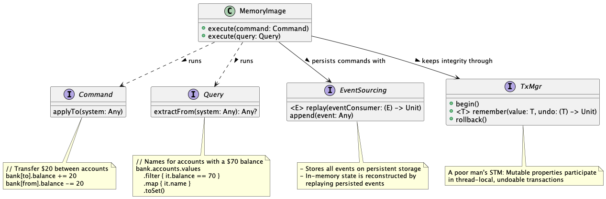

# Memory Image in Kotlin



A simple Kotlin implementation of the
[Memory Image](https://www.martinfowler.com/bliki/MemoryImage.html)
pattern:

```kotlin
// General idea; actual impl differs somewhat
class MemImg<S>(val system: S, eventSourcing: EventSourcing<S>, txMgr: TxMgr) {

    init {
        eventSourcing.allCommands().forEach { command -> command.execute(system) }
    }

    // Commands modify the state of the system
    // Mutable objects participate of transactions
    fun execute(command: Command<S>) =
        synchronized(this) { // Single-threaded, lightning-fast
            txMgr.begin()
            try {
                command.execute(system)
                eventSourcing.append(command)
                // Look ma: no need for commit()
            } catch (e: Exception) {
                txMgr.rollback()
                throw e
            }
        }

    fun execute(query: Query<S>) = query.execute(system)
}
```

## A Simple Example: Bank Accounts

```kotlin
typealias Amount = BigDecimal

class MemImgTest {

    // Or system class
    data class Bank(val accounts: MutableMap<String, Account> = HashMap())

    // Convenience mix-in to simplify interaction w/tx manage
    interface TxParticipant {
        fun <T> remember(property: KMutableProperty0<T>) {
            TxManager.remember(this, property.name, property.get(), property::set)
        }
    }

    data class Account(val id: String, val name: String) : TxParticipant {
        var balance: Amount = BigDecimal.ZERO
            internal set(value) {
                require(value > Amount.ZERO) {
                    "Can't have negative balance: $balance would become $value!"
                }
                // Remember value at start of transaction so as to rollback if needed
                remember(this::balance)
                field = value
            }
    }

    data class CreateAccount(val id: String, val name: String) : Command<Bank> {
        override fun execute(system: Bank) {
            system.accounts[id] = Account(id, name)
        }
    }

    abstract class AccountCommand(private val accountId: String) : Command<Bank> {
        abstract fun execute(account: Account)
        final override fun execute(system: Bank) {
            execute(system.accounts[accountId]!!)
        }
    }

    data class Deposit(val accountId: String, val amount: Amount) : AccountCommand(accountId) {
        override fun execute(account: Account) {
            account.balance += amount
        }
    }

    data class Withdrawal(val accountId: String, val amount: Amount) : AccountCommand(accountId) {
        override fun execute(account: Account) {
            account.balance -= amount
        }
    }

    data class Transfer(val fromAccountId: String, val toAccountId: String, val amount: Amount) : Command<Bank> {
        override fun execute(system: Bank) {
            // Operation order deliberately set to require rollback!
            Deposit(toAccountId, amount).execute(system)
            Withdrawal(fromAccountId, amount).execute(system)
        }
    }

    object BankSerializer : EventSourcing<Bank> {
        private val buffer = mutableListOf<Command<Bank>>()
        override fun allCommands(): Iterable<Command<Bank>> = buffer
        override fun append(command: Command<Bank>) { buffer += command }
    }

    @Test
    fun doIt() {

        val bank1 = Bank()
        val memimg1 = MemImg(bank1, BankSerializer)

        memimg1.execute(CreateAccount("janet", "Janet Doe"))
        assertEquals(Amount.ZERO, bank1.accounts["janet"]!!.balance)

        memimg1.execute(Deposit("janet", Amount("100")))
        assertEquals(Amount("100"), bank1.accounts["janet"]!!.balance)

        memimg1.execute(Withdrawal("janet", Amount("10")))
        assertEquals(Amount("90"), bank1.accounts["janet"]!!.balance)

        memimg1.execute(CreateAccount("john", "John Doe"))
        assertEquals(Amount.ZERO, bank1.accounts["john"]!!.balance)

        memimg1.execute(Deposit("john", Amount("50")))
        assertEquals(Amount("50"), bank1.accounts["john"]!!.balance)

        memimg1.execute(Transfer("janet", "john", Amount(20)))
        assertEquals(Amount("70"), bank1.accounts["janet"]!!.balance)
        assertEquals(Amount("70"), bank1.accounts["john"]!!.balance)

        val bank2 = Bank()
        val memimg2 = MemImg(bank2, BankSerializer)
        // Look ma: system state restored from empty initial state and event sourcing!
        assertEquals(Amount("70"), bank2.accounts["janet"]!!.balance)
        assertEquals(Amount("70"), bank2.accounts["john"]!!.balance)

        // Some random query; executes at in-memory speeds
        val accountsWith70 = memimg2.execute(object : Query<Bank> {
            override fun execute(system: Bank) =
                system.accounts.values
                    .filter { it.balance == Amount("70") }
                    .map { it.name }
                    .toSet()
        })
        assertEquals(setOf("Janet Doe", "John Doe"), accountsWith70)

        // Attempt to transfer beyond means...
        val insufficientFunds = assertThrows<Exception> {
            memimg2.execute(Transfer("janet", "john", Amount("1000")))
        }
        assertContains(insufficientFunds.message!!, "Can't have negative balance")
        // Look ma: system state restored on failure after partial mutation
        assertEquals(Amount("70"), bank2.accounts["janet"]!!.balance)
        assertEquals(Amount("70"), bank2.accounts["john"]!!.balance)
    }
}
```