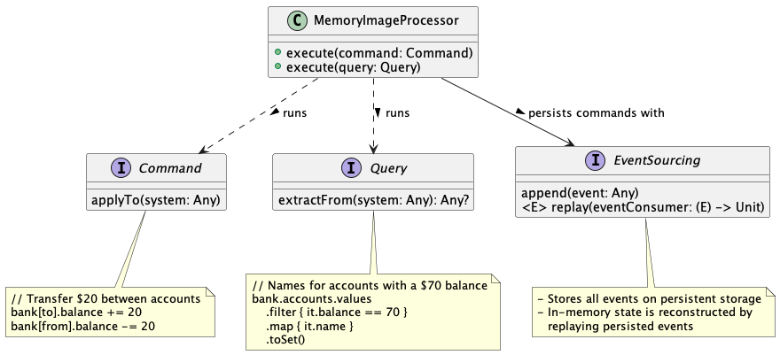
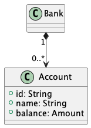
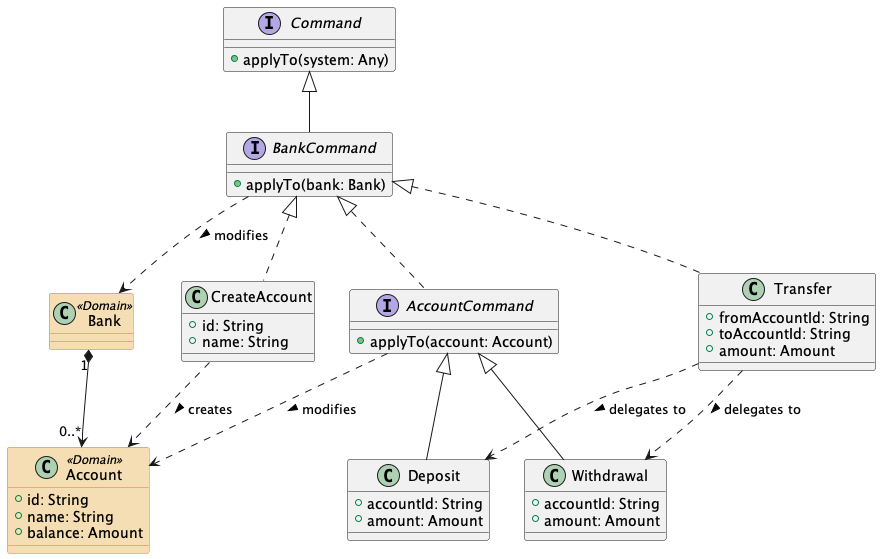
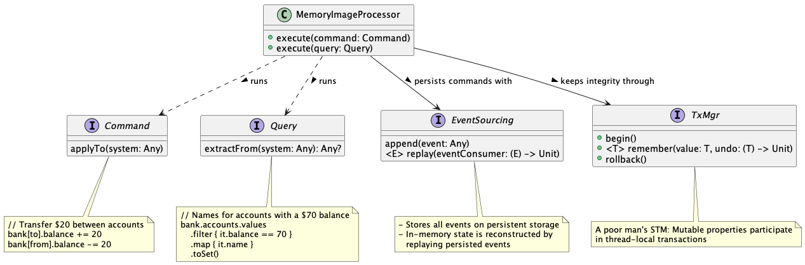

# Memory Image in Kotlin

> When people start an enterprise application, one of the earliest questions is "how do we talk to the database".
> These days they may ask a slightly different question:
> "what kind of database should we use - relational or one of these NOSQL databases?".
> 
> _But there's another question to consider: "should we use a database at all?_"
>
> -- [Martin Fowler](https://www.martinfowler.com/)
>


This article presents a [simple Kotlin implementation](https://github.com/xrrocha/kmemimg) of the
[Memory Image](https://www.martinfowler.com/bliki/MemoryImage.html) architectural pattern:



```kotlin
class MemoryImageProcessor(private val system: Any, 
                           private val eventSourcing: EventSourcing) {
    init {
        synchronized(this) {
            eventSourcing.replay<Command> { command -> command.applyTo(system) }
        }
    }

    fun execute(command: Command): Unit = synchronized(this) {
        TxManager.begin()
        try {
            command.applyTo(system)
            eventSourcing.append(command)
        } catch (e: Exception) {
            TxManager.rollback()
            throw e
        }
    }

    fun execute(query: Query): Any? = query.extractFrom(system)
}
```

## What is Memory Image?
Memory image provides a reliable persistence mechanism where all application data resides _safely_ in main memory.
Yes: good ole', volatile, random-access memory.

Provided you domain model fits in main memory (which is cheap and abundant nowadays) this approach yields significant
benefits over the established database-centric approach:

- Substantially faster transaction and query processing times as the system operates at RAM speeds!
- No [object-relation impedance mismatch](https://en.wikipedia.org/wiki/Object%E2%80%93relational_impedance_mismatch)
  to speak of as objects only reside natively in memory. No implementation-level 
  [ORM](https://en.wikipedia.org/wiki/Object%E2%80%93relational_mapping) limitations bubbling up to the design
- Much richer domain models leveraging advanced language and platform features, unhampered by persistence concerns.
  [DDD](https://en.wikipedia.org/wiki/Domain-driven_design) nirvana; the cure for
  [anemic domain models](https://en.wikipedia.org/wiki/Anemic_domain_model) 😉

## Hmm... Please Elaborate

Rather than persisting domain entities as such (as is done, typically, on a database) in the memory image approach
what gets persisted is _the sequence of application events that modify the state of the entities in the first place_.

Consider the following minimalistic bank domain model:



Here, a bank holds a collection of accounts each having a balance that changes in time as it responds to events such as:

- deposits
- withdrawals
- transfers

Each such an event can be modeled as a 
[_command_](https://en.wikipedia.org/wiki/Command_pattern) that, when applied to an account, modifies the account's
balance to reflect the banking operation embodied by the command.

This could be modeled as:



Let's take a look at a progression of commands and the evolving system state resulting from their successive
application:

<table border="1">
    <tr>
        <th align="center">Command</th>
        <th align="center">Resulting State</th>
    </tr>
    <tr>
        <td valign="top"><code>CreateAccount(id = "janet", name = "Janet Doe")</code></td>
        <td>
            <table border="1">
                <tr>
                    <th>Id</th>
                    <th>Name</th>
                    <th>Balance</th>
                </tr>
                <tr>
                    <td>janet</td>
                    <td nowrap>Janet Doe</td>
                    <td align="right">$0</td>
                </tr>
            </table>
        </td>
    </tr>
    <tr>
        <td valign="top"><code>Deposit(accountId = "janet", amount = 100)</code></td>
        <td>
            <table border="1">
                <tr>
                    <th>Id</th>
                    <th>Name</th>
                    <th>Balance</th>
                </tr>
                <tr>
                    <td>janet</td>
                    <td nowrap>Janet Doe</td>
                    <td align="right">$100</td>
                </tr>
            </table>
        </td>
    </tr>
    <tr>
        <td valign="top"><code>Withdrawal(accountId = "janet", amount = 10)</code></td>
        <td>
            <table border="1">
                <tr>
                    <th>Id</th>
                    <th>Name</th>
                    <th>Balance</th>
                </tr>
                <tr>
                    <td>janet</td>
                    <td nowrap>Janet Doe</td>
                    <td align="right">$90</td>
                </tr>
            </table>
        </td>
    </tr>
    <tr>
        <td valign="top"><code>CreateAccount(accountId = "john", name = "John Doe")</code></td>
        <td>
            <table border="1">
                <tr>
                    <th>Id</th>
                    <th>Name</th>
                    <th>Balance</th>
                </tr>
                <tr>
                    <td>janet</td>
                    <td nowrap>Janet Doe</td>
                    <td align="right">$90</td>
                </tr>
                <tr>
                    <td>john</td>
                    <td nowrap>John Doe</td>
                    <td align="right">$0</td>
                </tr>
            </table>
        </td>
    </tr>
    <tr>
        <td valign="top"><code>Deposit(accountId = "john", amount = 50)</code></td>
        <td>
            <table border="1">
                <tr>
                    <th>Id</th>
                    <th>Name</th>
                    <th>Balance</th>
                </tr>
                <tr>
                    <td>janet</td>
                    <td nowrap>Janet Doe</td>
                    <td align="right">$90</td>
                </tr>
                <tr>
                    <td>john</td>
                    <td nowrap>John Doe</td>
                    <td align="right">$50</td>
                </tr>
            </table>
        </td>
    </tr>
    <tr>
        <td valign="top"><code>Transfer(fromAccountId = "janet", toAccountId = "john", amount = 20)</code></td>
        <td>
            <table border="1">
                <tr>
                    <th>Id</th>
                    <th>Name</th>
                    <th>Balance</th>
                </tr>
                <tr>
                    <td>janet</td>
                    <td nowrap>Janet Doe</td>
                    <td align="right">$70</td>
                </tr>
                <tr>
                    <td>john</td>
                    <td nowrap>John Doe</td>
                    <td align="right">$70</td>
                </tr>
            </table>
        </td>
    </tr>
</table>

The key idea behind the memory image pattern is:

> Serialize all state-modifying commands on persistent storage.
> 
> Reconstruct in-memory application state by replaying the deserialized commands onto an empty initial state

Somewhat paradoxically, entity classes themselves don't need to be persisted! (But they might, for snapshotting, as 
mentioned below.)

If your application data fits into available memory and your event history fits into available disk space you're in 
business.

## Memory Image Processor

A _memory image processor_ consumes a stream of application commands by applying each incoming command to a mutable 
object (also referred to as the _system_).

Because applying commands in memory is so fast and cheap, _a memory image processor can run on a single thread_ and 
consume incoming command sequentially with no need to provide concurrent access to its system. This removes 
much of the complexity traditionally associated with transactions as conflicts arising from concurrent mutation 
simply do not occur.

Individual command application, however, _can_ fail in the midst of a transactional sequence of mutations so the memory 
image processor still needs a way to rollback partial changes and restore system integrity in the face of invalid data
and constraint violations.

Incoming commands should only be serialized upon successful completion. Obviously, if command serialization
fail, the memory image processor will stop processing further commands until command serialization is
restored.

Lastly, a memory image processor also services queries. 

A _query_ is another type of event which, unlike commands, does not mutate system state. Importantly, _queries are 
serviced in multi-threaded mode_ so querying the system is efficient and concurrent. Because in-memory access 
is so fast, many queries can be satisfied without indexing. However, special-purpose, in-memory indexing can be 
easily implemented as dictated by application requirements.

The following class diagram summarizes the memory image processor:



👉 Because application restarts entail reprocessing the (potentially large) history of all mutating commands,
_system snapshotting_ can be used to serialize the entire in-memory state on demand. This enables faster restarts
at the expense of losing the ability to time-travel. Note, though, that for many an application such an optimization
may bring more effort than benefit...

## Memory Image Processor in Kotlin

The above class diagram is materialized in Kotlin as:

```kotlin
interface Command {
    fun applyTo(system: Any)
}
interface Query {
    fun extractFrom(system: Any): Any?
}
interface EventSourcing {
    fun append(event: Any)
    fun <E> replay(eventConsumer: (E) -> Unit)
}
interface TxManager {
  fun begin()
  fun <T> remember(who: Any, what: String, value: T, undo: (T) -> Unit)
  fun rollback()
}

class MemoryImageProcessor(private val system: Any, 
                           private val eventSourcing: EventSourcing) {
    init {
        // Replay previously serialized events to restore in-memory system state
        synchronized(this) {
            // Any failure during initialization will be propagated
            eventSourcing.replay<Command> { command -> command.applyTo(system) }
        }
    }

    // Apply incoming command to system
    fun execute(command: Command): Unit = synchronized(this) { // Single-threaded
        TxManager.begin()
        try {
            command.applyTo(system) // Try and apply command
            try {
                eventSourcing.append(command) // Serialize; retry internally if needed
            } catch (e: Exception) {
                // Note: no attempt to rollback: this is irrecoverable
                logger.severe("Error persisting command: ${e.message ?: e.toString()}")
                // No further processing; start over when serialization is restored
                throw e
            }
        } catch (e: Exception) {
            TxManager.rollback() // Undo any partial mutation
            val errorMessage = "Error executing command: ${e.message ?: e.toString()}"
            // It's (kinda) ok for a command to fail
            // Re-throw as «CommandApplicationException» and go on
            throw CommandApplicationException("Error executing command: ${e.message}", e)
        }
    }

    // Run incoming query on system
    fun execute(query: Query): Any? = query.extractFrom(system) // Can be multi-threaded
}
```

## Simple Example: Bank Domain Model

To exercise the above memory image processor, let's revisit our bank domain model:


This is implemented in Kotlin as:

```kotlin
/* 1) Domain entities: Bank and Account */
typealias Amount = BigDecimal

data class Bank(val accounts: MutableMap<String, Account> = HashMap())

data class Account(val id: String, val name: String) {
    // Mutable property provides an initial value (Amount.ZERO) 
    // and a validation rule (it >= Amount.ZERO) to have delegate
    // mutate value and participate in transactions
    var balance: Amount by TxDelegate(Amount.ZERO) { it >= Amount.ZERO }
}

/* 2) Application commands: CreateAccount, Deposit, Withdrawal, Transfer */
interface BankCommand : Command {
    fun applyTo(bank: Bank)
    override fun applyTo(system: Any) = applyTo(system as Bank)
}
interface BankQuery : Query {
    fun extractFrom(bank: Bank): Any?
    override fun extractFrom(system: Any) = applyTo(system as Bank)
}
interface AccountCommand : BankCommand {
    val accountId: String
    fun applyTo(account: Account)
    override fun applyTo(bank: Bank) {
        applyTo(bank.accounts[accountId]!!)
    }
}

data class CreateAccount(val id: String, val name: String) : BankCommand {
    override fun applyTo(bank: Bank) {
        bank.accounts[id] = Account(id, name)
    }
}    
data class Deposit(override val accountId: String, val amount: Amount) : AccountCommand {
    override fun applyTo(account: Account) {
        account.balance += amount
    }
}
data class Withdrawal(override val accountId: String,val amount: Amount) : AccountCommand {
    override fun applyTo(account: Account) {
        account.balance -= amount
    }
}
data class Transfer(val fromAccountId: String, val toAccountId: String, val amount: Amount) : BankCommand {
    override fun applyTo(bank: Bank) {
        // Operation order deliberately set to benefit from rollback...
        Deposit(toAccountId, amount).applyTo(bank)
        Withdrawal(fromAccountId, amount).applyTo(bank)
    }
}
```

## Simple Example: Testing The Processor

The following test exercises the memory image processor using the same sequence of commands outlined above: 

```kotlin
val bank1 = Bank()
val memimg1 = MemImg(bank1, eventSourcing)

memimg1.execute(CreateAccount("janet", "Janet Doe"))
assertEquals(Amount.ZERO, bank1.accounts["janet"]!!.balance)

memimg1.execute(Deposit("janet", Amount(100)))
assertEquals(Amount(100), bank1.accounts["janet"]!!.balance)

memimg1.execute(Withdrawal("janet", Amount(10)))
assertEquals(Amount(90), bank1.accounts["janet"]!!.balance)

memimg1.execute(CreateAccount("john", "John Doe"))
assertEquals(Amount.ZERO, bank1.accounts["john"]!!.balance)

memimg1.execute(Deposit("john", Amount(50)))
assertEquals(Amount(50), bank1.accounts["john"]!!.balance)

memimg1.execute(Transfer("janet", "john", Amount(20)))
assertEquals(Amount(70), bank1.accounts["janet"]!!.balance)
assertEquals(Amount(70), bank1.accounts["john"]!!.balance)

memimg1.close()

val bank2 = Bank()
val memimg2 = MemImg(bank2, eventSourcing)
// Look ma: system state restored from empty initial state via event sourcing!
assertEquals(Amount(70), bank2.accounts["janet"]!!.balance)
assertEquals(Amount(70), bank2.accounts["john"]!!.balance)

// Some random query; executes at in-memory speeds
val accountsWith70 = memimg2.execute(object : BankQuery {
    override fun extractFrom(bank: Bank) =
        bank.accounts.values
            .filter { it.balance == Amount(70) }
            .map { it.name }
            .toSet()
})
assertEquals(setOf("Janet Doe", "John Doe"), accountsWith70)

// Attempt to transfer beyond means...
val insufficientFunds = assertThrows<CommandApplicationException> {
    memimg2.execute(Transfer("janet", "john", Amount(1000)))
}
assertContains(insufficientFunds.message!!, "Invalid value for Account.balance")
// Look ma: system state restored on failure after partial mutation
assertEquals(Amount(70), bank2.accounts["janet"]!!.balance)
assertEquals(Amount(70), bank2.accounts["john"]!!.balance)

memimg2.close()
```

## Conclusion

Memory image provides a simple, straightforward way to achieve high performance and simplicity without the 
complications associated with persisting objects on a database (whether SQL or not.)

Kotlin is a uniquely expressive language in which to implement this architectural pattern.  

Interested readers can inspect the working code at the [kmemimg](https://github.com/xrrocha/kmemimg) Github repository.
