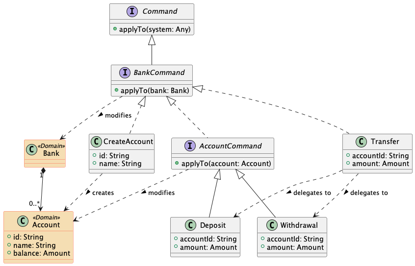

# Memory Image in Kotlin


A simple Kotlin implementation of the
[Memory Image](https://www.martinfowler.com/bliki/MemoryImage.html)
pattern:

```kotlin
class MemImg(private val system: Any, 
             private val BankEventSourcing: EventSourcing) {

    init {
        synchronized(this) {
            BankEventSourcing.replay<Command> { e -> e.executeOn(system) }
        }
    }

    fun executeOn(command: Command): Unit =
        synchronized(this) { // Single-threaded, lightning-fast
            TxManager.begin()
            try {
                command.executeOn(system)
                BankEventSourcing.append(command)
            } catch (e: Exception) {
                TxManager.rollback()
                logger.severe("Error in command: ${e.message}")
                throw e
            }
        }

    fun executeOn(query: Query): Any? = query.executeOn(system)
}
```

## A Simple Example: Bank Accounts



```kotlin
class MemImgTest {
    
    /* 1) Domain entities: Bank and Account */
    typealias Amount = BigDecimal
    
    data class Bank(val accounts: MutableMap<String, Account> = HashMap())
    
    data class Account(val id: String, val name: String) {
        var balance: Amount by TxDelegate(Amount.ZERO) { it >= Amount.ZERO }
    }
    
    /* 2) Application commands: Deposit, Withdrawal, Transfer */
    interface BankCommand : Command {
        fun executeOn(bank: Bank)
        override fun executeOn(system: Any) = executeOn(system as Bank)
    }
    interface BankQuery : Query {
        fun executeOn(bank: Bank): Any?
        override fun executeOn(system: Any) = executeOn(system as Bank)
    }
    interface AccountCommand : BankCommand {
        val accountId: String
        fun executeOn(account: Account)
        override fun executeOn(bank: Bank) {
            executeOn(bank.accounts[accountId]!!)
        }
    }
    
    data class CreateAccount(val id: String, val name: String) : BankCommand {
        override fun executeOn(bank: Bank) {
            bank.accounts[id] = Account(id, name)
        }
    }    
    
    data class Deposit(override val accountId: String, val amount: Amount) : AccountCommand {
        override fun executeOn(account: Account) {
            account.balance += amount
        }
    }
    
    data class Withdrawal(override val accountId: String,val amount: Amount) : AccountCommand {
        override fun executeOn(account: Account) {
            account.balance -= amount
        }
    }
    
    data class Transfer(val fromAccountId: String, val toAccountId: String, val amount: Amount) : BankCommand {
        override fun executeOn(bank: Bank) {
            // Operation order deliberately set so as to exercise rollback...
            Deposit(toAccountId, amount).executeOn(bank)
            Withdrawal(fromAccountId, amount).executeOn(bank)
        }
    }

    // In-memory, volatile, non-persistent event sourcing
    // Check actual source code for the (JSON File) real thing™
    object BankEventSourcing : EventSourcing {
        private val buffer = mutableListOf<Any>()
        override fun <E> replay(eventConsumer: (E) -> Unit) = buffer.forEach{eventConsumer(it as E)}
        override fun append(event: Any) { buffer += event }
    }

    @Test
    fun `builds and restores domain model state` () {
        val bank1 = Bank()
        val memimg1 = MemImg(bank1, BankEventSourcing)
        
        memimg1.execute(CreateAccount("janet", "Janet Doe"))
        assertEquals(Amount.ZERO, bank1.accounts["janet"]!!.balance)

        memimg1.execute(Deposit("janet", Amount(100)))
        assertEquals(Amount(100), bank1.accounts["janet"]!!.balance)

        memimg1.execute(Withdrawal("janet", Amount(10)))
        assertEquals(Amount(90), bank1.accounts["janet"]!!.balance)

        memimg1.execute(CreateAccount("john", "John Doe"))
        assertEquals(Amount.ZERO, bank1.accounts["john"]!!.balance)

        memimg1.execute(Deposit("john", Amount(50)))
        assertEquals(Amount(50), bank1.accounts["john"]!!.balance)

        memimg1.execute(Transfer("janet", "john", Amount(20)))
        assertEquals(Amount(70), bank1.accounts["janet"]!!.balance)
        assertEquals(Amount(70), bank1.accounts["john"]!!.balance)

        memimg1.close()

        val bank2 = Bank()
        val memimg2 = MemImg(bank2, BankEventSourcing)
        // Look ma: system state restored from empty initial state and event sourcing!
        assertEquals(Amount(70), bank2.accounts["janet"]!!.balance)
        assertEquals(Amount(70), bank2.accounts["john"]!!.balance)

        // Some random query; executes at in-memory speeds
        val accountsWith70 = memimg2.execute(object : BankQuery {
            override fun executeOn(bank: Bank) =
                bank.accounts.values
                    .filter { it.balance == Amount(70) }
                    .map { it.name }
                    .toSet()
        })
        assertEquals(setOf("Janet Doe", "John Doe"), accountsWith70)

        // Attempt to transfer beyond means...
        val insufficientFunds = assertThrows<Exception> {
            memimg2.execute(Transfer("janet", "john", Amount(1000)))
        }
        assertContains(insufficientFunds.message!!, "Invalid value for Account.balance")
        // Look ma: system state restored on failure after partial mutation
        assertEquals(Amount(70), bank2.accounts["janet"]!!.balance)
        assertEquals(Amount(70), bank2.accounts["john"]!!.balance)

        memimg2.execute(Transfer("john", "janet", Amount(10)))
        assertEquals(Amount(80), bank2.accounts["janet"]!!.balance)
        assertEquals(Amount(60), bank2.accounts["john"]!!.balance)

        memimg2.close()
    }
}
```